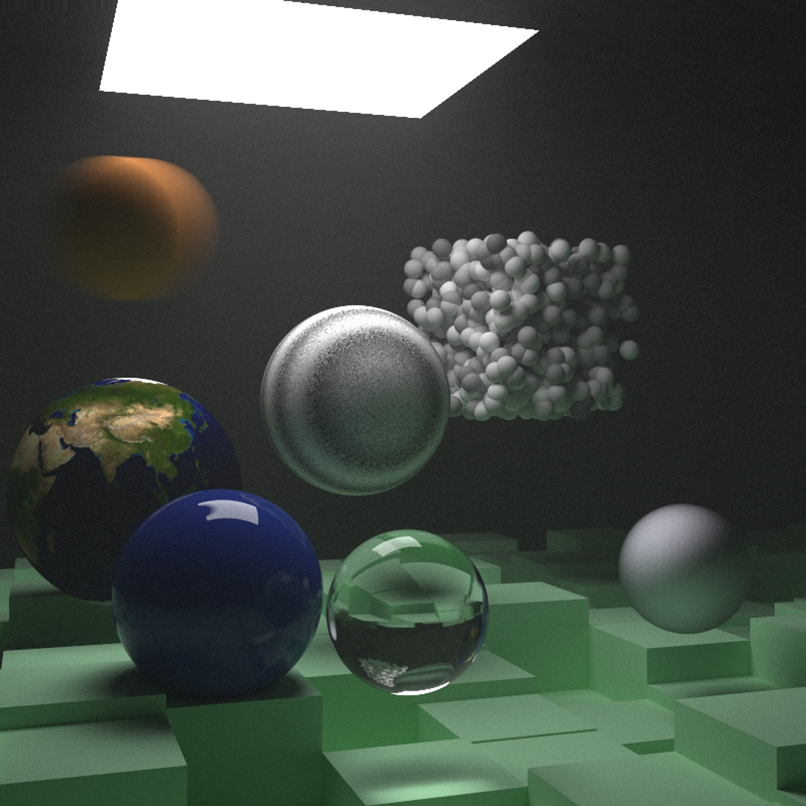
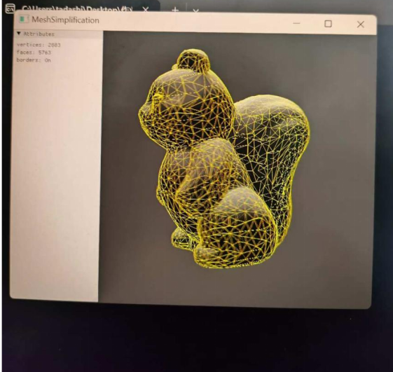

# Real-Time Rendering Practice

从底层渲染流程出发，探索实时图形系统中的空间变换、光照计算与几何处理，为 Unity XR 开发建立图形学基础。

---

## Rendering Pipeline Overview

```
  Vertex Data
       ↓
  Model / View / Projection Transform
       ↓
  Vertex Shader
       ↓
  Rasterization
       ↓
  Fragment Shader
       ↓
  Lighting Calculation (Phong)
       ↓
  Shadow Test (PCF)
       ↓
  Framebuffer
```

---

## Highlights

### Shadow Mapping — 自定义渲染模块


基于 OpenGL FBO + GLSL 实现完整阴影管线：

| 阶段 | 实现细节 |
|------|---------|
| Depth Pass | 以光源视角渲染场景到深度纹理（`shadow_map`） |
| Light Space Transform | 顶点经 `light_space_matrix` 变换到光源裁剪空间 |
| Perspective Divide | `fragPosLightSpace.xyz / w` → NDC → [0,1] 深度坐标 |
| Shadow Test | 比较当前片元深度与深度图采样值 |
| PCF 软阴影 | 3×3 核采样 + 均值滤波，消除锯齿边缘 |
| Bias | 深度偏移避免自阴影（surface acne） |

> **与 Unity/XR 的关联**：与 Unity URP 中 Shadow Caster Pass → Shadow Map → Shadow Resolve 流程核心思想类似。理解这套流程后，Unity 的 Light 组件参数（Bias、Normal Bias、Strength、Resolution）不再是黑盒。

关键文件：
- [light_shadow.frag](shadow-mapping/light_shadow.frag) — Phong 着色器 + Shadow Map + PCF
- [main.cpp](shadow-mapping/main.cpp) — 双 Pass 渲染管线（深度 Pass + 场景 Pass）
- [transform.cpp](shadow-mapping/transform.cpp) — Model/View/Projection 空间变换矩阵

---

### Ray Tracing — 离线渲染探索



从零实现基础光线追踪器，支持多种几何体与加速结构：

| 模块 | 实现 |
|------|------|
| 球体求交 | 判别式法解二次方程，支持运动模糊（球心按时间插值） |
| 四边形求交 | 平面相交 + 重心坐标判断点在四边形内部 |
| AABB 包围盒 | 六面 Quad 组合构造，支持轴对齐包围盒 |
| BVH 加速 | 层次包围盒递归遍历，按深度顺序剪枝 |
| 体积渲染 | Constant Medium 随机散射距离采样，模拟烟雾/云雾 |
| 材质系统 | 漫反射/镜面反射/电介质材质分离，支持纹理映射 |

> **与 Unity/XR 的关联**：光线追踪的空间求交逻辑与 VR 中 Raycast/射线检测同源。BVH 加速结构的概念对应 Unity 的 Physics 层级剔除。

关键文件：
- [hit.cpp](ray-tracing/hit.cpp) — 球体/四边形/BVH/体积渲染
- [camera.cpp](ray-tracing/camera.cpp) — 光线追踪相机模型

---

### Mesh Simplification — 几何处理



网格（5,763 → 1,887 → 965 faces），基于 Quadric Error Metrics（QEM）实现边坍缩网格简化：

| 步骤 | 实现 |
|------|------|
| Q 矩阵计算 | 每个顶点累加相邻面的误差二次型 `Kp = n·nᵀ` |
| 最优坍缩位置 | 解线性系统求最小误差点；不可逆时取中点 |
| 坍缩代价 | `vᵀ·(Q₁+Q₂)·v`，优先级队列维护最小代价边 |
| 拓扑更新 | 坍缩后重映射顶点索引，移除退化面 |

> **与 Unity/XR 的关联**：网格简化的误差度量思想与 Unity 等实时引擎中 LOD（Level of Detail）优化的核心思想相关。

关键代码：[mesh-simplification/mesh_simplification.cpp](mesh-simplification/mesh_simplification.cpp)

---

## Repository Structure

```
.
├── shadow-mapping/
│   ├── light_shadow.frag      # Phong 着色 + Shadow Map + PCF
│   ├── main.cpp               # 双 Pass 渲染管线
│   ├── transform.cpp          # 空间变换矩阵
│   ├── images/                # 效果截图
│   └── Shadow-Mapping-Notes.pdf
├── ray-tracing/
│   ├── hit.cpp                # 球体/四边形/BVH/体积渲染
│   ├── camera.cpp             # 光线追踪相机
│   ├── images/                # 渲染结果
│   └── Ray-Tracing-Notes.pdf
├── mesh-simplification/
│   ├── mesh_simplification.h  # Edge 数据结构
│   ├── mesh_simplification.cpp # QEM 边坍缩算法
│   ├── quadrics.pdf           # 参考论文
│   ├── images/                # 简化前后对比
│   └── Mesh-Simplification-Notes.pdf
```

---

## References

- [GAMES101 - 现代计算机图形学入门](https://sites.cs.ucsb.edu/~lingqi/teaching/games101.html)
- [GAMES102 - 几何建模与处理](http://staff.ustc.edu.cn/~lgliu/Courses/GAMES102_2020/default.html)
- [Ray Tracing in One Weekend 系列](https://raytracing.github.io/)
- [BUAA-VR-Courses / Realtime-3D-Graphics](https://github.com/BUAA-VR-Courses/Realtime-3D-Graphics) — 课程框架
